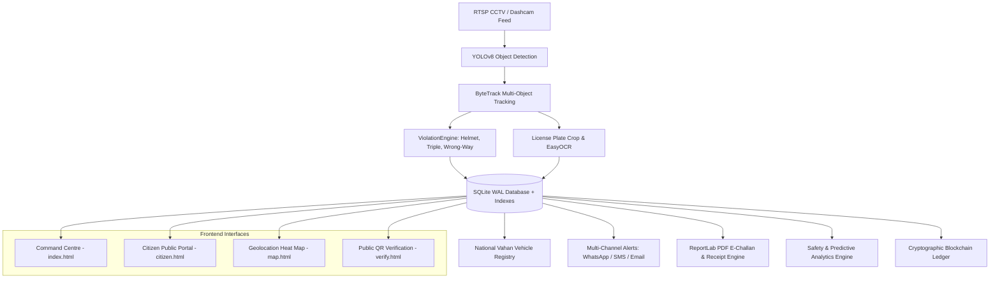

# 🚦 TrafficGuard Pro — AI Traffic Enforcement & Safety Command Grid
### *सत्यमेव जयते · AI for Road Safety & Transparent Governance*

[](https://www.python.org/)
[](https://flask.palletsprojects.com/)
[](https://ultralytics.com/)
[](LICENSE)
[]()

**TrafficGuard Pro** is an AI-powered Indian traffic enforcement and road safety intelligence command system. Built for smart cities and traffic police divisions, it uses custom-trained **YOLOv8**, **ByteTrack**, and **EasyOCR** to automatically intercept infractions, look up National Vahan records, dispatch multi-channel e-challans (WhatsApp, SMS, Email), compute accident blackspots, and manage dispute resolution tribunals with cryptographic immutability.

---

## 👤 Project Founder & Lead Architect
**Pawan Singh** — Founder & Full-Stack AI Engineer  
- **Education:** B.Tech Computer Science & Engineering (CSE), Delhi Technical Campus (DTC), Greater Noida  
- **University:** Guru Gobind Singh Indraprastha University (GGSIPU)  
- **Email:** [pawan9140582015@gmail.com](mailto:pawan9140582015@gmail.com)  
- **GitHub:** [github.com/pawan00207](https://github.com/pawan00207)  
- **LinkedIn:** Pawan Singh  

---

## 🌟 Hackathon Feature Matrix

| # | Feature Domain | Capability & Specification | Status |
|---|---|---|:---:|
| 1 | **Helmet Detection** | YOLOv8 + 20-frame voting window (Sec 129 MV Act, ₹1,000 fine) | ✅ |
| 2 | **Triple Riding Detection** | IoU overlap > 50% on motorcycle ROI (Sec 128 MV Act, ₹1,000 fine) | ✅ |
| 3 | **Wrong-Way Detection** | Dual-mode ByteTrack trajectory closing speed (Sec 184 MV Act, ₹5,000) | ✅ |
| 4 | **Indian ANPR / OCR** | High-precision Indian plate parser across all 36 States/UTs | ✅ |
| 5 | **Geolocation Heat Map** | Leaflet.js interactive map with Top 5 Hotspots drill-down | ✅ |
| 6 | **Predictive Analytics** | Hourly violation distribution bar chart & accident risk zones | ✅ |
| 7 | **Officer Dashboard** | Enforcement leaderboard, accuracy rankings, and badges | ✅ |
| 8 | **Citizen Public Portal** | Masked plate lookup, 15-day dispute tribunal, instant online pay | ✅ |
| 9 | **WhatsApp & SMS Alerts** | Meta Cloud API + Twilio WhatsApp & SMS fallback | ✅ |
| 10 | **Two-Way WhatsApp Bot** | Interactive bot for `STATUS`, `PAY`, `RULES`, `DISPUTE` | ✅ |
| 11 | **Saarthi AI Chatbot** | Bilingual (Hindi + English) Motor Vehicles Act knowledge engine | ✅ |
| 12 | **Suraksha Gamification** | 0-100 safe driving score & digital certificate generator | ✅ |
| 13 | **National Vahan DB** | 50+ pre-seeded vehicles + procedural fallback for ANY plate | ✅ |
| 14 | **Blockchain Audit** | SHA-256 cryptographic immutability block ledger | ✅ |
| 15 | **Automated PDF Reports** | Multi-page Monthly & Daily PDF reports for Police HQ | ✅ |
| 16 | **Role-Based Access (RBAC)** | 4 user roles: Superadmin, Admin, Inspector, Citizen | ✅ |
| 17 | **Live SSE Push Stream** | Real-time event broadcasting to command centre tabs | ✅ |
| 18 | **Multi-Language (i18n)** | UI support for English, हिन्दी (Hindi), and ਪੰਜਾਬੀ (Punjabi) | ✅ |

---

## 🏛️ System Architecture



---

## 🚀 Quickstart & Setup Guide

### 1. Local Setup

```bash
# Clone the repository
git clone https://github.com/pawan00207/RoadX-traffic-enforcement.git
cd RoadX-traffic-enforcement

# Create virtual environment
python -m venv venv
venv\Scripts\activate     # Linux/Mac: source venv/bin/activate

# Install dependencies
pip install -r requirements.txt

# Run test suite
python -m pytest tests/ -v

# Launch application
python app.py
```

Open your browser:
- **Officer Command Centre:** `http://localhost:5001/` (Login: `admin` / `pawan123` or click 1-Click Demo)
- **Citizen Public Portal:** `http://localhost:5001/citizen`
- **Geolocation Hotspot Map:** `http://localhost:5001/map`

### 2. Docker Deployment

```bash
docker build -t trafficguard-pro .
docker run -p 5001:5001 trafficguard-pro
```

---

## 🔐 Credentials & Default Roles

| Role | Username / Selection | Password | Permissions |
|---|---|---|---|
| **Superadmin** | Superadmin | `superadmin123` | Full access, settings, DB export, audit log |
| **Admin** | Admin | `pawan123` | Interceptor control, disputes, monthly reports |
| **Inspector** | Inspector | `inspector123` | Live feeds, review queue, challan management |
| **Demo Access** | Demo | `demo123` | 1-Click read-only evaluation mode |
| **Citizen** | Public | No password | Plate search, online payment, dispute filing |

---

## 🔮 Future Roadmap
- 📡 **Drone Interceptor Integration**: Real-time aerial patrol video analysis for expressway traffic.
- ⚡ **Automated Green Corridor for Ambulances**: Priority traffic light preemption.
- 👁️ **Facial Recognition (Future Regulatory Item)**: Documented as a future roadmap item subject to statutory privacy clearance.

---

**© 2026 TrafficGuard Pro · Developed by Pawan Singh · All Rights Reserved.**
